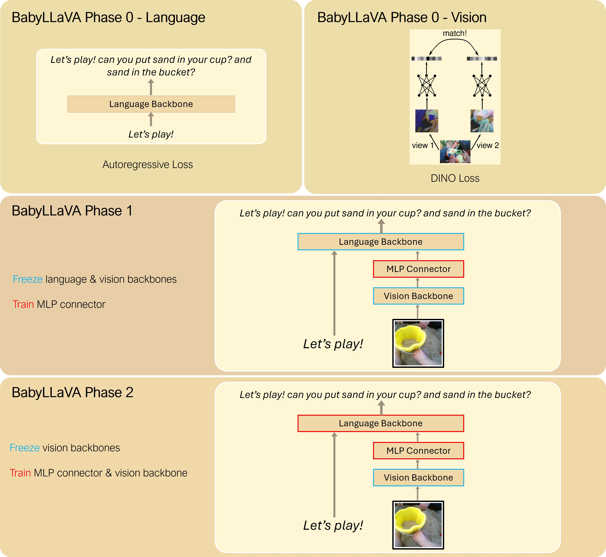

# BabyLLaVA: Generative VLM Trained-from-scratch on SAYCam 

📄 [Paper](https://arxiv.org/abs/2504.09426) | 🌐 [Project Page](https://shawnking98.github.io/BabyVLM/)

[Shengao Wang](https://www.linkedin.com/in/shengao-wang-a259aa173/en)<sup>1</sup>,
[Arjun Chandra](https://www.linkedin.com/in/arjun-chandra2/)<sup>1</sup>,
[Aoming Liu](https://cs-people.bu.edu/amliu/)<sup>1</sup>,
[Venkatesh Saligrama](https://venkatesh-saligrama.github.io/)<sup>1</sup>,
[Boqing Gong](http://boqinggong.info/)<sup>1</sup>

<sup>1</sup>Boston University

## Overview

This is the codebase of BabyLLaVA model series introduced in BabyVLM, adapted from the original [LLaVA repository](https://github.com/haotian-liu/LLaVA).

## Environment Setup

Install this package by cloning the repository and running the following command:

```bash
git clone https://github.com/ShawnKing98/babylmms-eval.git
cd babylmms-eval
pip install -e .
```

Optionally, install additional packages for training BabyLLaVA:

```bash
pip install -e ".[train]"
pip install flash-attn --no-build-isolation
```

## Data Preparation

To be updated. Please check back later.

## Usage
Please refer to the original [LLaVA repository](https://github.com/haotian-liu/LLaVA) for the usage of the BabyLLaVA model, most of the APIs should be the same.

## Training
In addition to the two-stage training recipe of the original LLaVA, BabyLLaVA introduces a phase 0 training stage in order to train the language backbone and the vision backbone separately, before doing the unimodal training, as shown in the figure below.



### Phase 0:
Run the following command to train a compact language model from scratch on the transcribed SAYCam:

```bash
bash scripts/babyLLaVA_train/phase0.sh
```

We use [Orhan](https://huggingface.co/eminorhan) et al.'s vision backbone, which is trained using DINO on SAYCam images. Please check [their paper](https://arxiv.org/abs/2305.15372) for more details about the vision backbone.

### Phase 1 & 2:
Run the following command for phase 1 training:
```bash
bash scripts/babyLLaVA_train/phase1.sh
```
Run the following command for phase 2 training:
```bash
bash scripts/babyLLaVA_train/phase2.sh
```

## Citation

Please cite us if you use this repository in your work.

```bibtex
@misc{wang2025babyvlmdataefficientpretrainingvlms,
      title={BabyVLM: Data-Efficient Pretraining of VLMs Inspired by Infant Learning}, 
      author={Shengao Wang and Arjun Chandra and Aoming Liu and Venkatesh Saligrama and Boqing Gong},
      year={2025},
      eprint={2504.09426},
      archivePrefix={arXiv},
      primaryClass={cs.CV},
      url={https://arxiv.org/abs/2504.09426}, 
}
```